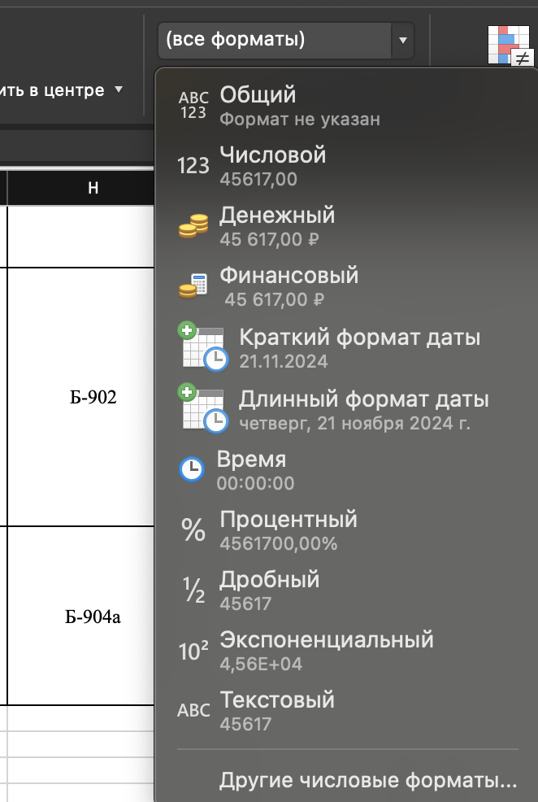

# [WIP] chto-tam-po-peresdacham

### Функциональные требования

- Excel таблицы будут скачиваться вручную, напрямую с сайта университета. Они будут храниться статически, напрямую на
  сервере
  (т.к. на первом этапе изменение данных возможно раз в семестр, когда и публикуют список пересдач).
- *Должна существовать реализация рестарта сервиса, на случай, если упадет. Самый простой способ реализовать это -
  написать Bash скрипт, проверяющий процесс. (пока можно забить)
- Процесс парсинга проходит не на "голых" файлах с сайта университета, а предварительно обработанных вручную (в будущем
  планируется упразднить данный шаг, если на сайте университета будут выкладывать одинаковые таблицы с пересдачами).
- В tg боте фильтрация пересдач будет по критерию `Институт`+`Группа`. Если в файле для предмета что-то не задано (
  институт или группа), такие кейсы мы не обрабатываем.

### Не функциональные требования

- Парсим только файлы в формате .XLSX
- На первом этапе позволительно парсить не все виды таблиц, т.к. многие из них отличаются названием полей/столбцов,
  наполнением и т.д.
  Достаточно поддержать парсинг наиболее распространенного шаблона.
- Никаких оптимизаций по взаимодействию с telegram API и с парсингом .xsls файлов на данном этапе не требуется.
- Текущие поддерживаемые поля из таблиц. В шаблонных таблицах должны быть **ТОЛЬКО** эти поля:

1. `Дисциплина`
2. `Институт`
3. `Кафедра`  
4. `Курс`     
5. `Группа`       
6. `Преподаватель`   
7. `Дата`        
8. `Время`
9. `Аудитория`   
10. `Примечание` (здесь храним ссылки на зум, и прочую полезную инфу)

### Формат данных в файле `.xlsx`:

1. Дата: `02.01.2006`. Ячейка с датой **НЕ должна** быть никак форматирована (в экселе настройка "Формат ячейки":
   Дата/Общий/Числовой/...):
   
2. Время: `15:04`
3. Группа: `БИВТ-21-1` либо список групп, разделенных запятыми:

```
БИВТ-21-1,
БИВТ-20-1,
...
```

либо

```
БИВТ-21-1,БИВТ-20-1,...
```

**Сокращения вида `БИВТ-20-1,2,3,8` не поддерживаем!**